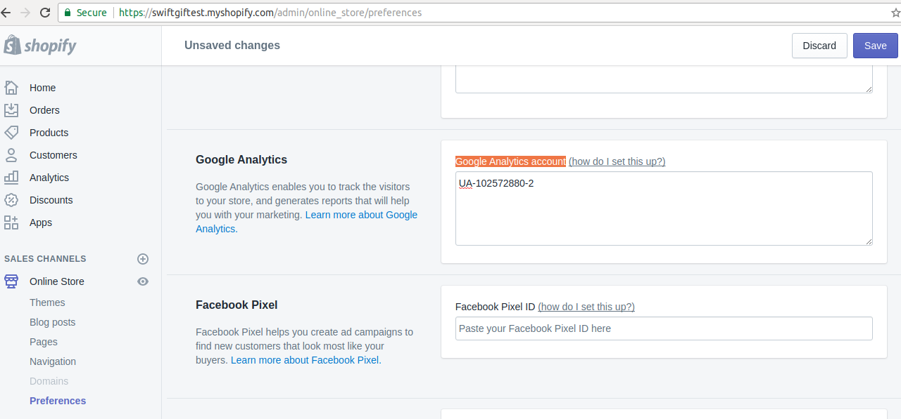
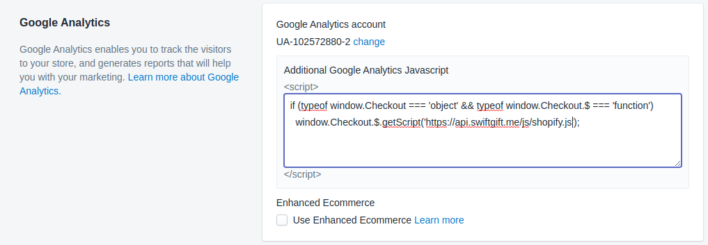
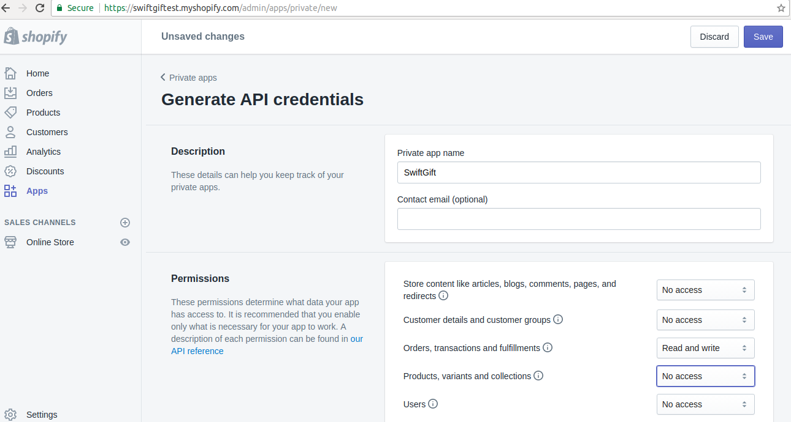

## SwiftGift plugin for Shopify

This plugin allows your customers to send any items purchased in your store as a gift, to their friends. Plugin modifies checkout pages by adding a gift option.

**TODO**: improve description of our product, add more marketing bullshit.

**TODO**: add screenshots of modified checkout pages.

### Integration

To integrate SwiftGift plugin into your Shopify based store you should perform
the following steps:

  - Contact us via b2b@swiftgift.me providing information about your Shopify store (name, URL, logo image). Our team will revert with your SwiftGift account's details (such as client ID and password for admin panel).

  Also you should decide what URL of gift receive page you want to use. It can be `https://<yourname>.swiftgift.me/<giftcode>` or `https://swiftgift.<yourdomain>/<giftcode>`. In the second case you should create `CNAME` record in your domain's DNS settings with `swiftgift.<yourdomain>` points to `swiftgift.me`.

  - Set up Google Analytics for your Shopify store as described [here](https://help.shopify.com/manual/reports-and-analytics/google-analytics/google-analytics-setup#enable-universal-analytics) (Enable Universal Analytics scenario only) if you haven't done it yet. The main aim of this step is to obtain Google Analytics's Tracking ID and putting it into "Google Analytics account" field in your store's preferences.

  

  - Add the following custom JavaScript in Google Analytics section:

    ```js
    if (typeof window.Checkout === 'object' && typeof window.Checkout.$ === 'function')
      window.Checkout.$.getScript('https://api.swiftgift.me/js/shopify.js');
    ```

  

  Previous two steps are performed on https://yourstore.myshopify.com/admin/online_store/preferences page. And please do not forget to click "Save" button after each step :)

  - Grant orders access to our Shopify app to be able to get delivery address when gift's recipients will accept their gifts automatically. Go to your Shopify store's admin panel, click on Apps menu item, then click on "Manage private apps" on the bottom of the page, then click on "Generate API credentials" button. Fill app's name by `SwiftGift` and allow the only one permission "Orders, transactions and fulfillments" to "Read and write", then click Save button.

  

  Please, provide "API key" and "Password" to our manager via b2b@swiftgift.me in order to allow us to update your orders by delivery address when gift's recipients will accept their gifts automatically.

That's all! We hope this wasn't not too complicated - for any questions please contact us on b2b@swiftgift.me
We are confident that using our Shopify plugin will drive additional new revenues and increase LTV of your customers, as well as providing them with an improved customer journey.

### Test environment

If you want to test plugin's integration with your test store without real transactions, you can use staging version of our plugin. To connect it to your test store, just replace URL in Custom Google Analytics JavaScript from `https://api.swiftgift.me/js/shopify.js` to `https://api-staging.swiftgift.me/js/shopify.js`:

```js
if (typeof window.Checkout === 'object' && typeof window.Checkout.$ === 'function')
  window.Checkout.$.getScript('https://api-staging.swiftgift.me/js/shopify.js');
```
